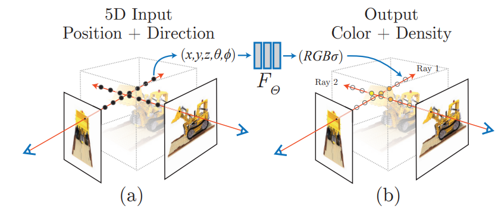

Best Paper
### Adding Conditional Control to Text-to-Image Diffusion Models
https://arxiv.org/abs/2302.05543 meta

#### 概要
- diffusion modelのfine-tuningの手法
- プロンプト以外のものをコンディションとして使える
- "zero convolutions" (zero-initialized convolution layers) の導入

基本的なアーキテクチャ

SDに組み込むと↓のようになる。（Encoderに対応するコピーを作り、zero convolutionの結果を対応するEncoderの出力に戻す）

コメント: 初期状態では元のアーキテクチャと同じなので、ノイズがなく学習が安定すると書いてあったがそれ以上の理論的な説明は書いていなかった。

### MULLER: Multilayer Laplacian Resizer for Vision
https://arxiv.org/abs/2304.02859 google

#### 概要
- Multilayer Laplacian decompositionを用いた画像リサイズ手法
- 異なる標準偏差のガウシアンフィルターの差をバントパスフィルターとして使って複数スケールの画像特徴を抽出(Laplacian decomposition)
- 軽量（6個のパラメータ）
- 画像分類、物体検出およびセグメンテーション等複数のビジョンタスクに広く適用可能(MaxVitで最大0.6%のトップ1精度の向上)
- 推論コストを36%節約

コメント: 仕事でも使えそう

Best Student Paper

### Tracking Everything Everywhere All At Once
https://arxiv.org/abs/2306.05422v2 Cornell University, Google Research, UC Berkeley

概要
- optical flow trackingタスク
- TAP-VidベンチマークでRAFTなどのSOTAに優位性
    - 追跡性能: occulusionに対してロバスト
    - 時間的一貫性: より長い時間追跡可能
- ビデオを準3Dの正準体積で表現し、ローカル空間と正準空間の間の全単射を介してピクセル単位の追跡を行う

　直交する方向に等間隔に例を飛ばして位置をサンプリング（何をサンプリング？）→清純空間に飛ばしてαと色をつけさせる　→　Alpha compositeで持ってくる

Neural Parts: Learning Expressive 3D Shape Abstractions
with Invertible Neural Netw

Nerf(https://arxiv.org/abs/2003.08934)

- 連続するフレーム間のフロー損失項 $L_{flo}$
- 3Dモーションが時間的に滑らかであることを確保するため、大きな加速度にペナルティを与える正則化項　$L_{reg}$

最適化するニューラルネットは↓

$T_j(F_θ(T_i(x_{k_i})))$

コメント: orthographic cameraじゃないと成立しないらしい。

### LightGlue: Local Feature Matching at Light Speed
ETH Zurich, Microsoft Mixed Reality & AI Lab
https://arxiv.org/abs/2306.13643v1

概要
- 特徴点マッチング
- SOTAであったSuperGlueメモリ効率と計算量の面で上回った
- LoFTR等のdence matcherと同等の性能
- 3D再構成のようなレイテンシーが重要な場面で活用の可能性

- 符号化された位置情報と局所特徴量でセルフ/crossアテンションでコンテキストを学習
- メッセージ$m_i$(アテンションスコアで重みづけされたvalue)を出し、MLPを使って局所特徴量$x_i$を更新
- 類似度スコアとマッチ可能性スコアを組み合わせて、ソフトな部分割り当て行列を生成しグラフ理論でマッチングを扱える形にする
- マッチングのexit条件を満たせば終了。満たさないなら繰り返す。

セルフアテンション

MLPを使って局所特徴量$x_i$を更新

類似度スコア, マッチ可能性スコア, ソフト部分割り当て行列

あとは組み合わせ最適化の問題

https://ikatakos.com/pot/programming_algorithm/graph_theory/bipartite_matching

### 資料
https://www.paperdigest.org/2023/09/iccv-2023-highlights/
https://iccv2023.thecvf.com/iccv2023.opening.slides-38--MTI.php
https://paperswithcode.com/conference/iccv-2023-1
https://github.com/DmitryRyumin/ICCV-2023-Papers
https://github.com/amusi/ICCV2023-Papers-with-Code
https://hirokatsukataoka.net/temp/presen/231006ICCV%202023%20Report%20(Release%20Ver.).pdf
https://twitter.com/kantocv
https://www.connectedpapers.com/main/408399600631b7eacf491dae0ac997fb5c13ccc7/Tracking-Everything-Everywhere-All-at-Once/graph

14
CLIP:Contrastive Language–Image Pretraining  画像と語彙のペアを同じ特徴量空間に埋め込むやつ
Foundation: 基盤モデル　巨大なデータセットで事前学習されていていろいろなタスクができるモデル
https://research-p.com/column/1468
nerfないっすね...

15
Scene Graph: ブジェクト（物体）、それらの属性、およびオブジェクト間の関係をグラフの形式で表現する形式。意味論的な階層構造をもつのでロボとかで使われがち

16
diffusion model:

低レベルビジョン（Low-Level Vision）：
画像の基本的な特性や構造を分析する分野
画像のエッジ検出、テクスチャ分析、色彩の調整、ノイズ、シャープネスなどの観点から画像を見る。
物理ベースのビジョン（Physics-based Vision）：
光の反射や屈折など物理を使って現象をモデリングして画像解析に活かすっぽい（よくわからない）

Best Paper
### Adding Conditional Control to Text-to-Image Diffusion Models
https://arxiv.org/abs/2302.05543 meta

#### 概要
- diffusion modelのfine-tuningの手法
- プロンプト以外のものをコンディションとして使える
- "zero convolutions" (zero-initialized convolution layers) の導入

基本的なアーキテクチャ

SDに組み込むと↓のようになる。（Encoderに対応するコピーを作り、zero convolutionの結果を対応するEncoderの出力に戻す）

コメント: 初期状態では元のアーキテクチャと同じなので、ノイズがなく学習が安定すると書いてあったがそれ以上の理論的な説明は書いていなかった。

### MULLER: Multilayer Laplacian Resizer for Vision
https://arxiv.org/abs/2304.02859 google

#### 概要
- Multilayer Laplacian decompositionを用いた画像リサイズ手法
- 異なる標準偏差のガウシアンフィルターの差をバントパスフィルターとして使って複数スケールの画像特徴を抽出(Laplacian decomposition)
- 軽量（6個のパラメータ）
- 画像分類、物体検出およびセグメンテーション等複数のビジョンタスクに広く適用可能(MaxVitで最大0.6%のトップ1精度の向上)
- 推論コストを36%節約

コメント: 仕事でも使えそう

Best Student Paper

### Tracking Everything Everywhere All At Once
https://arxiv.org/abs/2306.05422v2 Cornell University, Google Research, UC Berkeley

概要
- optical flow trackingタスク
- TAP-VidベンチマークでRAFTなどのSOTAに優位性
    - 追跡性能: occulusionに対してロバスト
    - 時間的一貫性: より長い時間追跡可能
- ビデオを準3Dの正準体積で表現し、ローカル空間と正準空間の間の全単射を介してピクセル単位の追跡を行う

　直交する方向に等間隔に例を飛ばして位置をサンプリング（何をサンプリング？）→清純空間に飛ばしてαと色をつけさせる　→　Alpha compositeで持ってくる

Neural Parts: Learning Expressive 3D Shape Abstractions
with Invertible Neural Netw

Nerf(https://arxiv.org/abs/2003.08934)

- 連続するフレーム間のフロー損失項 $L_{flo}$
- 3Dモーションが時間的に滑らかであることを確保するため、大きな加速度にペナルティを与える正則化項　$L_{reg}$

最適化するニューラルネットは↓

$T_j(F_θ(T_i(x_{k_i})))$

コメント: orthographic cameraじゃないと成立しないらしい。

### LightGlue: Local Feature Matching at Light Speed
ETH Zurich, Microsoft Mixed Reality & AI Lab
https://arxiv.org/abs/2306.13643v1

概要
- 特徴点マッチング
- SOTAであったSuperGlueメモリ効率と計算量の面で上回った
- LoFTR等のdence matcherと同等の性能
- 3D再構成のようなレイテンシーが重要な場面で活用の可能性

- 符号化された位置情報と局所特徴量でセルフ/crossアテンションでコンテキストを学習
- メッセージ$m_i$(アテンションスコアで重みづけされたvalue)を出し、MLPを使って局所特徴量$x_i$を更新
- 類似度スコアとマッチ可能性スコアを組み合わせて、ソフトな部分割り当て行列を生成しグラフ理論でマッチングを扱える形にする
- マッチングのexit条件を満たせば終了。満たさないなら繰り返す。

セルフアテンション

MLPを使って局所特徴量$x_i$を更新

類似度スコア, マッチ可能性スコア, ソフト部分割り当て行列

あとは組み合わせ最適化の問題

https://ikatakos.com/pot/programming_algorithm/graph_theory/bipartite_matching

### 資料
https://www.paperdigest.org/2023/09/iccv-2023-highlights/
https://iccv2023.thecvf.com/iccv2023.opening.slides-38--MTI.php
https://paperswithcode.com/conference/iccv-2023-1
https://github.com/DmitryRyumin/ICCV-2023-Papers
https://github.com/amusi/ICCV2023-Papers-with-Code
https://hirokatsukataoka.net/temp/presen/231006ICCV%202023%20Report%20(Release%20Ver.).pdf
https://twitter.com/kantocv
https://www.connectedpapers.com/main/408399600631b7eacf491dae0ac997fb5c13ccc7/Tracking-Everything-Everywhere-All-at-Once/graph

14
CLIP:Contrastive Language–Image Pretraining  画像と語彙のペアを同じ特徴量空間に埋め込むやつ
Foundation: 基盤モデル　巨大なデータセットで事前学習されていていろいろなタスクができるモデル
https://research-p.com/column/1468
nerfないっすね...

15
Scene Graph: ブジェクト（物体）、それらの属性、およびオブジェクト間の関係をグラフの形式で表現する形式。意味論的な階層構造をもつのでロボとかで使われがち

16
diffusion model:

低レベルビジョン（Low-Level Vision）：
画像の基本的な特性や構造を分析する分野
画像のエッジ検出、テクスチャ分析、色彩の調整、ノイズ、シャープネスなどの観点から画像を見る。
物理ベースのビジョン（Physics-based Vision）：
光の反射や屈折など物理を使って現象をモデリングして画像解析に活かすっぽい（よくわからない）

Best Paper
### Adding Conditional Control to Text-to-Image Diffusion Models
https://arxiv.org/abs/2302.05543 meta

#### 概要
- diffusion modelのfine-tuningの手法
- プロンプト以外のものをコンディションとして使える
- "zero convolutions" (zero-initialized convolution layers) の導入

基本的なアーキテクチャ

SDに組み込むと↓のようになる。（Encoderに対応するコピーを作り、zero convolutionの結果を対応するEncoderの出力に戻す）

コメント: 初期状態では元のアーキテクチャと同じなので、ノイズがなく学習が安定すると書いてあったがそれ以上の理論的な説明は書いていなかった。

### MULLER: Multilayer Laplacian Resizer for Vision
https://arxiv.org/abs/2304.02859 google

#### 概要
- Multilayer Laplacian decompositionを用いた画像リサイズ手法
- 異なる標準偏差のガウシアンフィルターの差をバントパスフィルターとして使って複数スケールの画像特徴を抽出(Laplacian decomposition)
- 軽量（6個のパラメータ）
- 画像分類、物体検出およびセグメンテーション等複数のビジョンタスクに広く適用可能(MaxVitで最大0.6%のトップ1精度の向上)
- 推論コストを36%節約

コメント: 仕事でも使えそう

Best Student Paper

### Tracking Everything Everywhere All At Once
https://arxiv.org/abs/2306.05422v2 Cornell University, Google Research, UC Berkeley

概要
- optical flow trackingタスク
- TAP-VidベンチマークでRAFTなどのSOTAに優位性
    - 追跡性能: occulusionに対してロバスト
    - 時間的一貫性: より長い時間追跡可能
- ビデオを準3Dの正準体積で表現し、ローカル空間と正準空間の間の全単射を介してピクセル単位の追跡を行う

　直交する方向に等間隔に例を飛ばして位置をサンプリング（何をサンプリング？）→清純空間に飛ばしてαと色をつけさせる　→　Alpha compositeで持ってくる

Neural Parts: Learning Expressive 3D Shape Abstractions
with Invertible Neural Netw

Nerf(https://arxiv.org/abs/2003.08934)

- 連続するフレーム間のフロー損失項 $L_{flo}$
- 3Dモーションが時間的に滑らかであることを確保するため、大きな加速度にペナルティを与える正則化項　$L_{reg}$

最適化するニューラルネットは↓

$T_j(F_θ(T_i(x_{k_i})))$

コメント: orthographic cameraじゃないと成立しないらしい。

### LightGlue: Local Feature Matching at Light Speed
ETH Zurich, Microsoft Mixed Reality & AI Lab
https://arxiv.org/abs/2306.13643v1

概要
- 特徴点マッチング
- SOTAであったSuperGlueメモリ効率と計算量の面で上回った
- LoFTR等のdence matcherと同等の性能
- 3D再構成のようなレイテンシーが重要な場面で活用の可能性

- 符号化された位置情報と局所特徴量でセルフ/crossアテンションでコンテキストを学習
- メッセージ$m_i$(アテンションスコアで重みづけされたvalue)を出し、MLPを使って局所特徴量$x_i$を更新
- 類似度スコアとマッチ可能性スコアを組み合わせて、ソフトな部分割り当て行列を生成しグラフ理論でマッチングを扱える形にする
- マッチングのexit条件を満たせば終了。満たさないなら繰り返す。

セルフアテンション

MLPを使って局所特徴量$x_i$を更新

類似度スコア, マッチ可能性スコア, ソフト部分割り当て行列

あとは組み合わせ最適化の問題

https://ikatakos.com/pot/programming_algorithm/graph_theory/bipartite_matching

### 資料
https://www.paperdigest.org/2023/09/iccv-2023-highlights/
https://iccv2023.thecvf.com/iccv2023.opening.slides-38--MTI.php
https://paperswithcode.com/conference/iccv-2023-1
https://github.com/DmitryRyumin/ICCV-2023-Papers
https://github.com/amusi/ICCV2023-Papers-with-Code
https://hirokatsukataoka.net/temp/presen/231006ICCV%202023%20Report%20(Release%20Ver.).pdf
https://twitter.com/kantocv
https://www.connectedpapers.com/main/408399600631b7eacf491dae0ac997fb5c13ccc7/Tracking-Everything-Everywhere-All-at-Once/graph

14
CLIP:Contrastive Language–Image Pretraining  画像と語彙のペアを同じ特徴量空間に埋め込むやつ
Foundation: 基盤モデル　巨大なデータセットで事前学習されていていろいろなタスクができるモデル
https://research-p.com/column/1468
nerfないっすね...

15
Scene Graph: ブジェクト（物体）、それらの属性、およびオブジェクト間の関係をグラフの形式で表現する形式。意味論的な階層構造をもつのでロボとかで使われがち

16
diffusion model:

低レベルビジョン（Low-Level Vision）：
画像の基本的な特性や構造を分析する分野
画像のエッジ検出、テクスチャ分析、色彩の調整、ノイズ、シャープネスなどの観点から画像を見る。
物理ベースのビジョン（Physics-based Vision）：
光の反射や屈折など物理を使って現象をモデリングして画像解析に活かすっぽい（よくわからない）

Best Paper
### Adding Conditional Control to Text-to-Image Diffusion Models
https://arxiv.org/abs/2302.05543 meta

#### 概要
- diffusion modelのfine-tuningの手法
- プロンプト以外のものをコンディションとして使える
- "zero convolutions" (zero-initialized convolution layers) の導入

基本的なアーキテクチャ

SDに組み込むと↓のようになる。（Encoderに対応するコピーを作り、zero convolutionの結果を対応するEncoderの出力に戻す）

コメント: 初期状態では元のアーキテクチャと同じなので、ノイズがなく学習が安定すると書いてあったがそれ以上の理論的な説明は書いていなかった。

### MULLER: Multilayer Laplacian Resizer for Vision
https://arxiv.org/abs/2304.02859 google

#### 概要
- Multilayer Laplacian decompositionを用いた画像リサイズ手法
- 異なる標準偏差のガウシアンフィルターの差をバントパスフィルターとして使って複数スケールの画像特徴を抽出(Laplacian decomposition)
- 軽量（6個のパラメータ）
- 画像分類、物体検出およびセグメンテーション等複数のビジョンタスクに広く適用可能(MaxVitで最大0.6%のトップ1精度の向上)
- 推論コストを36%節約

コメント: 仕事でも使えそう

Best Student Paper

### Tracking Everything Everywhere All At Once
https://arxiv.org/abs/2306.05422v2 Cornell University, Google Research, UC Berkeley

概要
- optical flow trackingタスク
- TAP-VidベンチマークでRAFTなどのSOTAに優位性
    - 追跡性能: occulusionに対してロバスト
    - 時間的一貫性: より長い時間追跡可能
- ビデオを準3Dの正準体積で表現し、ローカル空間と正準空間の間の全単射を介してピクセル単位の追跡を行う

　直交する方向に等間隔に例を飛ばして位置をサンプリング（何をサンプリング？）→清純空間に飛ばしてαと色をつけさせる　→　Alpha compositeで持ってくる

Neural Parts: Learning Expressive 3D Shape Abstractions
with Invertible Neural Netw

Nerf(https://arxiv.org/abs/2003.08934)

- 連続するフレーム間のフロー損失項 $L_{flo}$
- 3Dモーションが時間的に滑らかであることを確保するため、大きな加速度にペナルティを与える正則化項　$L_{reg}$

最適化するニューラルネットは↓

$T_j(F_θ(T_i(x_{k_i})))$

コメント: orthographic cameraじゃないと成立しないらしい。

### LightGlue: Local Feature Matching at Light Speed
ETH Zurich, Microsoft Mixed Reality & AI Lab
https://arxiv.org/abs/2306.13643v1

概要
- 特徴点マッチング
- SOTAであったSuperGlueメモリ効率と計算量の面で上回った
- LoFTR等のdence matcherと同等の性能
- 3D再構成のようなレイテンシーが重要な場面で活用の可能性

- 符号化された位置情報と局所特徴量でセルフ/crossアテンションでコンテキストを学習
- メッセージ$m_i$(アテンションスコアで重みづけされたvalue)を出し、MLPを使って局所特徴量$x_i$を更新
- 類似度スコアとマッチ可能性スコアを組み合わせて、ソフトな部分割り当て行列を生成しグラフ理論でマッチングを扱える形にする
- マッチングのexit条件を満たせば終了。満たさないなら繰り返す。

セルフアテンション

MLPを使って局所特徴量$x_i$を更新

類似度スコア, マッチ可能性スコア, ソフト部分割り当て行列

あとは組み合わせ最適化の問題

https://ikatakos.com/pot/programming_algorithm/graph_theory/bipartite_matching

### 資料
https://www.paperdigest.org/2023/09/iccv-2023-highlights/
https://iccv2023.thecvf.com/iccv2023.opening.slides-38--MTI.php
https://paperswithcode.com/conference/iccv-2023-1
https://github.com/DmitryRyumin/ICCV-2023-Papers
https://github.com/amusi/ICCV2023-Papers-with-Code
https://hirokatsukataoka.net/temp/presen/231006ICCV%202023%20Report%20(Release%20Ver.).pdf
https://twitter.com/kantocv
https://www.connectedpapers.com/main/408399600631b7eacf491dae0ac997fb5c13ccc7/Tracking-Everything-Everywhere-All-at-Once/graph

14
CLIP:Contrastive Language–Image Pretraining  画像と語彙のペアを同じ特徴量空間に埋め込むやつ
Foundation: 基盤モデル　巨大なデータセットで事前学習されていていろいろなタスクができるモデル
https://research-p.com/column/1468
nerfないっすね...

15
Scene Graph: ブジェクト（物体）、それらの属性、およびオブジェクト間の関係をグラフの形式で表現する形式。意味論的な階層構造をもつのでロボとかで使われがち

16
diffusion model:

低レベルビジョン（Low-Level Vision）：
画像の基本的な特性や構造を分析する分野
画像のエッジ検出、テクスチャ分析、色彩の調整、ノイズ、シャープネスなどの観点から画像を見る。
物理ベースのビジョン（Physics-based Vision）：
光の反射や屈折など物理を使って現象をモデリングして画像解析に活かすっぽい（よくわからない）

Best Paper
### Adding Conditional Control to Text-to-Image Diffusion Models
https://arxiv.org/abs/2302.05543 meta

#### 概要
- diffusion modelのfine-tuningの手法
- プロンプト以外のものをコンディションとして使える
- "zero convolutions" (zero-initialized convolution layers) の導入

基本的なアーキテクチャ

SDに組み込むと↓のようになる。（Encoderに対応するコピーを作り、zero convolutionの結果を対応するEncoderの出力に戻す）

コメント: 初期状態では元のアーキテクチャと同じなので、ノイズがなく学習が安定すると書いてあったがそれ以上の理論的な説明は書いていなかった。

### MULLER: Multilayer Laplacian Resizer for Vision
https://arxiv.org/abs/2304.02859 google

#### 概要
- Multilayer Laplacian decompositionを用いた画像リサイズ手法
- 異なる標準偏差のガウシアンフィルターの差をバントパスフィルターとして使って複数スケールの画像特徴を抽出(Laplacian decomposition)
- 軽量（6個のパラメータ）
- 画像分類、物体検出およびセグメンテーション等複数のビジョンタスクに広く適用可能(MaxVitで最大0.6%のトップ1精度の向上)
- 推論コストを36%節約

コメント: 仕事でも使えそう

Best Student Paper

### Tracking Everything Everywhere All At Once
https://arxiv.org/abs/2306.05422v2 Cornell University, Google Research, UC Berkeley

概要
- optical flow trackingタスク
- TAP-VidベンチマークでRAFTなどのSOTAに優位性
    - 追跡性能: occulusionに対してロバスト
    - 時間的一貫性: より長い時間追跡可能
- ビデオを準3Dの正準体積で表現し、ローカル空間と正準空間の間の全単射を介してピクセル単位の追跡を行う

　直交する方向に等間隔に例を飛ばして位置をサンプリング（何をサンプリング？）→清純空間に飛ばしてαと色をつけさせる　→　Alpha compositeで持ってくる

Neural Parts: Learning Expressive 3D Shape Abstractions
with Invertible Neural Netw

Nerf(https://arxiv.org/abs/2003.08934)

- 連続するフレーム間のフロー損失項 $L_{flo}$
- 3Dモーションが時間的に滑らかであることを確保するため、大きな加速度にペナルティを与える正則化項　$L_{reg}$

最適化するニューラルネットは↓

$T_j(F_θ(T_i(x_{k_i})))$

コメント: orthographic cameraじゃないと成立しないらしい。

### LightGlue: Local Feature Matching at Light Speed
ETH Zurich, Microsoft Mixed Reality & AI Lab
https://arxiv.org/abs/2306.13643v1

概要
- 特徴点マッチング
- SOTAであったSuperGlueメモリ効率と計算量の面で上回った
- LoFTR等のdence matcherと同等の性能
- 3D再構成のようなレイテンシーが重要な場面で活用の可能性

- 符号化された位置情報と局所特徴量でセルフ/crossアテンションでコンテキストを学習
- メッセージ$m_i$(アテンションスコアで重みづけされたvalue)を出し、MLPを使って局所特徴量$x_i$を更新
- 類似度スコアとマッチ可能性スコアを組み合わせて、ソフトな部分割り当て行列を生成しグラフ理論でマッチングを扱える形にする
- マッチングのexit条件を満たせば終了。満たさないなら繰り返す。

セルフアテンション

MLPを使って局所特徴量$x_i$を更新

類似度スコア, マッチ可能性スコア, ソフト部分割り当て行列

あとは組み合わせ最適化の問題

https://ikatakos.com/pot/programming_algorithm/graph_theory/bipartite_matching

### 資料
https://www.paperdigest.org/2023/09/iccv-2023-highlights/
https://iccv2023.thecvf.com/iccv2023.opening.slides-38--MTI.php
https://paperswithcode.com/conference/iccv-2023-1
https://github.com/DmitryRyumin/ICCV-2023-Papers
https://github.com/amusi/ICCV2023-Papers-with-Code
https://hirokatsukataoka.net/temp/presen/231006ICCV%202023%20Report%20(Release%20Ver.).pdf
https://twitter.com/kantocv
https://www.connectedpapers.com/main/408399600631b7eacf491dae0ac997fb5c13ccc7/Tracking-Everything-Everywhere-All-at-Once/graph

14
CLIP:Contrastive Language–Image Pretraining  画像と語彙のペアを同じ特徴量空間に埋め込むやつ
Foundation: 基盤モデル　巨大なデータセットで事前学習されていていろいろなタスクができるモデル
https://research-p.com/column/1468
nerfないっすね...

15
Scene Graph: ブジェクト（物体）、それらの属性、およびオブジェクト間の関係をグラフの形式で表現する形式。意味論的な階層構造をもつのでロボとかで使われがち

16
diffusion model:

低レベルビジョン（Low-Level Vision）：
画像の基本的な特性や構造を分析する分野
画像のエッジ検出、テクスチャ分析、色彩の調整、ノイズ、シャープネスなどの観点から画像を見る。
物理ベースのビジョン（Physics-based Vision）：
光の反射や屈折など物理を使って現象をモデリングして画像解析に活かすっぽい（よくわからない）

Best Paper
### Adding Conditional Control to Text-to-Image Diffusion Models
https://arxiv.org/abs/2302.05543 meta

#### 概要
- diffusion modelのfine-tuningの手法
- プロンプト以外のものをコンディションとして使える
- "zero convolutions" (zero-initialized convolution layers) の導入

基本的なアーキテクチャ

SDに組み込むと↓のようになる。（Encoderに対応するコピーを作り、zero convolutionの結果を対応するEncoderの出力に戻す）

コメント: 初期状態では元のアーキテクチャと同じなので、ノイズがなく学習が安定すると書いてあったがそれ以上の理論的な説明は書いていなかった。

### MULLER: Multilayer Laplacian Resizer for Vision
https://arxiv.org/abs/2304.02859 google

#### 概要
- Multilayer Laplacian decompositionを用いた画像リサイズ手法
- 異なる標準偏差のガウシアンフィルターの差をバントパスフィルターとして使って複数スケールの画像特徴を抽出(Laplacian decomposition)
- 軽量（6個のパラメータ）
- 画像分類、物体検出およびセグメンテーション等複数のビジョンタスクに広く適用可能(MaxVitで最大0.6%のトップ1精度の向上)
- 推論コストを36%節約

コメント: 仕事でも使えそう

Best Student Paper

### Tracking Everything Everywhere All At Once
https://arxiv.org/abs/2306.05422v2 Cornell University, Google Research, UC Berkeley

概要
- optical flow trackingタスク
- TAP-VidベンチマークでRAFTなどのSOTAに優位性
    - 追跡性能: occulusionに対してロバスト
    - 時間的一貫性: より長い時間追跡可能
- ビデオを準3Dの正準体積で表現し、ローカル空間と正準空間の間の全単射を介してピクセル単位の追跡を行う

　直交する方向に等間隔に例を飛ばして位置をサンプリング（何をサンプリング？）→清純空間に飛ばしてαと色をつけさせる　→　Alpha compositeで持ってくる

Neural Parts: Learning Expressive 3D Shape Abstractions
with Invertible Neural Netw

Nerf(https://arxiv.org/abs/2003.08934)

- 連続するフレーム間のフロー損失項 $L_{flo}$
- 3Dモーションが時間的に滑らかであることを確保するため、大きな加速度にペナルティを与える正則化項　$L_{reg}$

最適化するニューラルネットは↓

$T_j(F_θ(T_i(x_{k_i})))$

コメント: orthographic cameraじゃないと成立しないらしい。

### LightGlue: Local Feature Matching at Light Speed
ETH Zurich, Microsoft Mixed Reality & AI Lab
https://arxiv.org/abs/2306.13643v1

概要
- 特徴点マッチング
- SOTAであったSuperGlueメモリ効率と計算量の面で上回った
- LoFTR等のdence matcherと同等の性能
- 3D再構成のようなレイテンシーが重要な場面で活用の可能性

- 符号化された位置情報と局所特徴量でセルフ/crossアテンションでコンテキストを学習
- メッセージ$m_i$(アテンションスコアで重みづけされたvalue)を出し、MLPを使って局所特徴量$x_i$を更新
- 類似度スコアとマッチ可能性スコアを組み合わせて、ソフトな部分割り当て行列を生成しグラフ理論でマッチングを扱える形にする
- マッチングのexit条件を満たせば終了。満たさないなら繰り返す。

セルフアテンション

MLPを使って局所特徴量$x_i$を更新

類似度スコア, マッチ可能性スコア, ソフト部分割り当て行列

あとは組み合わせ最適化の問題

https://ikatakos.com/pot/programming_algorithm/graph_theory/bipartite_matching

### 資料
https://www.paperdigest.org/2023/09/iccv-2023-highlights/
https://iccv2023.thecvf.com/iccv2023.opening.slides-38--MTI.php
https://paperswithcode.com/conference/iccv-2023-1
https://github.com/DmitryRyumin/ICCV-2023-Papers
https://github.com/amusi/ICCV2023-Papers-with-Code
https://hirokatsukataoka.net/temp/presen/231006ICCV%202023%20Report%20(Release%20Ver.).pdf
https://twitter.com/kantocv
https://www.connectedpapers.com/main/408399600631b7eacf491dae0ac997fb5c13ccc7/Tracking-Everything-Everywhere-All-at-Once/graph

14
CLIP:Contrastive Language–Image Pretraining  画像と語彙のペアを同じ特徴量空間に埋め込むやつ
Foundation: 基盤モデル　巨大なデータセットで事前学習されていていろいろなタスクができるモデル
https://research-p.com/column/1468
nerfないっすね...

15
Scene Graph: ブジェクト（物体）、それらの属性、およびオブジェクト間の関係をグラフの形式で表現する形式。意味論的な階層構造をもつのでロボとかで使われがち

16
diffusion model:

低レベルビジョン（Low-Level Vision）：
画像の基本的な特性や構造を分析する分野
画像のエッジ検出、テクスチャ分析、色彩の調整、ノイズ、シャープネスなどの観点から画像を見る。
物理ベースのビジョン（Physics-based Vision）：
光の反射や屈折など物理を使って現象をモデリングして画像解析に活かすっぽい（よくわからない）

Best Paper
### Adding Conditional Control to Text-to-Image Diffusion Models
https://arxiv.org/abs/2302.05543 meta

#### 概要
- diffusion modelのfine-tuningの手法
- プロンプト以外のものをコンディションとして使える
- "zero convolutions" (zero-initialized convolution layers) の導入

基本的なアーキテクチャ

SDに組み込むと↓のようになる。（Encoderに対応するコピーを作り、zero convolutionの結果を対応するEncoderの出力に戻す）

コメント: 初期状態では元のアーキテクチャと同じなので、ノイズがなく学習が安定すると書いてあったがそれ以上の理論的な説明は書いていなかった。

### MULLER: Multilayer Laplacian Resizer for Vision
https://arxiv.org/abs/2304.02859 google

#### 概要
- Multilayer Laplacian decompositionを用いた画像リサイズ手法
- 異なる標準偏差のガウシアンフィルターの差をバントパスフィルターとして使って複数スケールの画像特徴を抽出(Laplacian decomposition)
- 軽量（6個のパラメータ）
- 画像分類、物体検出およびセグメンテーション等複数のビジョンタスクに広く適用可能(MaxVitで最大0.6%のトップ1精度の向上)
- 推論コストを36%節約

コメント: 仕事でも使えそう

Best Student Paper

### Tracking Everything Everywhere All At Once
https://arxiv.org/abs/2306.05422v2 Cornell University, Google Research, UC Berkeley

概要
- optical flow trackingタスク
- TAP-VidベンチマークでRAFTなどのSOTAに優位性
    - 追跡性能: occulusionに対してロバスト
    - 時間的一貫性: より長い時間追跡可能
- ビデオを準3Dの正準体積で表現し、ローカル空間と正準空間の間の全単射を介してピクセル単位の追跡を行う

　直交する方向に等間隔に例を飛ばして位置をサンプリング（何をサンプリング？）→清純空間に飛ばしてαと色をつけさせる　→　Alpha compositeで持ってくる

Neural Parts: Learning Expressive 3D Shape Abstractions
with Invertible Neural Netw

Nerf(https://arxiv.org/abs/2003.08934)

- 連続するフレーム間のフロー損失項 $L_{flo}$
- 3Dモーションが時間的に滑らかであることを確保するため、大きな加速度にペナルティを与える正則化項　$L_{reg}$

最適化するニューラルネットは↓

$T_j(F_θ(T_i(x_{k_i})))$

コメント: orthographic cameraじゃないと成立しないらしい。

### LightGlue: Local Feature Matching at Light Speed
ETH Zurich, Microsoft Mixed Reality & AI Lab
https://arxiv.org/abs/2306.13643v1

概要
- 特徴点マッチング
- SOTAであったSuperGlueメモリ効率と計算量の面で上回った
- LoFTR等のdence matcherと同等の性能
- 3D再構成のようなレイテンシーが重要な場面で活用の可能性

- 符号化された位置情報と局所特徴量でセルフ/crossアテンションでコンテキストを学習
- メッセージ$m_i$(アテンションスコアで重みづけされたvalue)を出し、MLPを使って局所特徴量$x_i$を更新
- 類似度スコアとマッチ可能性スコアを組み合わせて、ソフトな部分割り当て行列を生成しグラフ理論でマッチングを扱える形にする
- マッチングのexit条件を満たせば終了。満たさないなら繰り返す。

セルフアテンション

MLPを使って局所特徴量$x_i$を更新

類似度スコア, マッチ可能性スコア, ソフト部分割り当て行列

あとは組み合わせ最適化の問題

https://ikatakos.com/pot/programming_algorithm/graph_theory/bipartite_matching

### 資料
https://www.paperdigest.org/2023/09/iccv-2023-highlights/
https://iccv2023.thecvf.com/iccv2023.opening.slides-38--MTI.php
https://paperswithcode.com/conference/iccv-2023-1
https://github.com/DmitryRyumin/ICCV-2023-Papers
https://github.com/amusi/ICCV2023-Papers-with-Code
https://hirokatsukataoka.net/temp/presen/231006ICCV%202023%20Report%20(Release%20Ver.).pdf
https://twitter.com/kantocv
https://www.connectedpapers.com/main/408399600631b7eacf491dae0ac997fb5c13ccc7/Tracking-Everything-Everywhere-All-at-Once/graph

14
CLIP:Contrastive Language–Image Pretraining  画像と語彙のペアを同じ特徴量空間に埋め込むやつ
Foundation: 基盤モデル　巨大なデータセットで事前学習されていていろいろなタスクができるモデル
https://research-p.com/column/1468
nerfないっすね...

15
Scene Graph: ブジェクト（物体）、それらの属性、およびオブジェクト間の関係をグラフの形式で表現する形式。意味論的な階層構造をもつのでロボとかで使われがち

16
diffusion model:

低レベルビジョン（Low-Level Vision）：
画像の基本的な特性や構造を分析する分野
画像のエッジ検出、テクスチャ分析、色彩の調整、ノイズ、シャープネスなどの観点から画像を見る。
物理ベースのビジョン（Physics-based Vision）：
光の反射や屈折など物理を使って現象をモデリングして画像解析に活かすっぽい（よくわからない）

Best Paper
### Adding Conditional Control to Text-to-Image Diffusion Models
https://arxiv.org/abs/2302.05543 meta

#### 概要
- diffusion modelのfine-tuningの手法
- プロンプト以外のものをコンディションとして使える
- "zero convolutions" (zero-initialized convolution layers) の導入

基本的なアーキテクチャ

SDに組み込むと↓のようになる。（Encoderに対応するコピーを作り、zero convolutionの結果を対応するEncoderの出力に戻す）

コメント: 初期状態では元のアーキテクチャと同じなので、ノイズがなく学習が安定すると書いてあったがそれ以上の理論的な説明は書いていなかった。

### MULLER: Multilayer Laplacian Resizer for Vision
https://arxiv.org/abs/2304.02859 google

#### 概要
- Multilayer Laplacian decompositionを用いた画像リサイズ手法
- 異なる標準偏差のガウシアンフィルターの差をバントパスフィルターとして使って複数スケールの画像特徴を抽出(Laplacian decomposition)
- 軽量（6個のパラメータ）
- 画像分類、物体検出およびセグメンテーション等複数のビジョンタスクに広く適用可能(MaxVitで最大0.6%のトップ1精度の向上)
- 推論コストを36%節約

コメント: 仕事でも使えそう

Best Student Paper

### Tracking Everything Everywhere All At Once
https://arxiv.org/abs/2306.05422v2 Cornell University, Google Research, UC Berkeley

概要
- optical flow trackingタスク
- TAP-VidベンチマークでRAFTなどのSOTAに優位性
    - 追跡性能: occulusionに対してロバスト
    - 時間的一貫性: より長い時間追跡可能
- ビデオを準3Dの正準体積で表現し、ローカル空間と正準空間の間の全単射を介してピクセル単位の追跡を行う

　直交する方向に等間隔に例を飛ばして位置をサンプリング（何をサンプリング？）→清純空間に飛ばしてαと色をつけさせる　→　Alpha compositeで持ってくる

Neural Parts: Learning Expressive 3D Shape Abstractions
with Invertible Neural Netw

Nerf(https://arxiv.org/abs/2003.08934)

- 連続するフレーム間のフロー損失項 $L_{flo}$
- 3Dモーションが時間的に滑らかであることを確保するため、大きな加速度にペナルティを与える正則化項　$L_{reg}$

最適化するニューラルネットは↓

$T_j(F_θ(T_i(x_{k_i})))$

コメント: orthographic cameraじゃないと成立しないらしい。

### LightGlue: Local Feature Matching at Light Speed
ETH Zurich, Microsoft Mixed Reality & AI Lab
https://arxiv.org/abs/2306.13643v1

概要
- 特徴点マッチング
- SOTAであったSuperGlueメモリ効率と計算量の面で上回った
- LoFTR等のdence matcherと同等の性能
- 3D再構成のようなレイテンシーが重要な場面で活用の可能性

- 符号化された位置情報と局所特徴量でセルフ/crossアテンションでコンテキストを学習
- メッセージ$m_i$(アテンションスコアで重みづけされたvalue)を出し、MLPを使って局所特徴量$x_i$を更新
- 類似度スコアとマッチ可能性スコアを組み合わせて、ソフトな部分割り当て行列を生成しグラフ理論でマッチングを扱える形にする
- マッチングのexit条件を満たせば終了。満たさないなら繰り返す。

セルフアテンション

MLPを使って局所特徴量$x_i$を更新

類似度スコア, マッチ可能性スコア, ソフト部分割り当て行列

あとは組み合わせ最適化の問題

https://ikatakos.com/pot/programming_algorithm/graph_theory/bipartite_matching

### 資料
https://www.paperdigest.org/2023/09/iccv-2023-highlights/
https://iccv2023.thecvf.com/iccv2023.opening.slides-38--MTI.php
https://paperswithcode.com/conference/iccv-2023-1
https://github.com/DmitryRyumin/ICCV-2023-Papers
https://github.com/amusi/ICCV2023-Papers-with-Code
https://hirokatsukataoka.net/temp/presen/231006ICCV%202023%20Report%20(Release%20Ver.).pdf
https://twitter.com/kantocv
https://www.connectedpapers.com/main/408399600631b7eacf491dae0ac997fb5c13ccc7/Tracking-Everything-Everywhere-All-at-Once/graph

